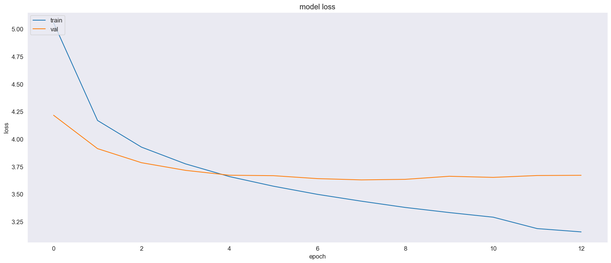
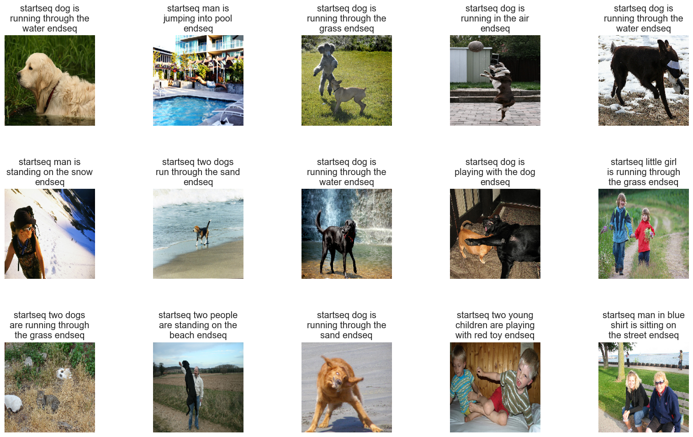

# Image Captioning using CNN-LSTM
This repository implements an image captioning system using Convolutional Neural Networks (CNNs) for image feature extraction and Long Short-Term Memory (LSTM) networks for sequence prediction. The model generates descriptive captions for images, leveraging the strengths of both CNNs and LSTMs.

## Table of Contents
-Introduction
-Setup and Installation
-Data Preparation
-Model Architecture
-Training the Model
-Evaluation and Inference
-Results
-Future Work
-Contributing
-License

## Introduction
Image Captioning is the process of generating textual descriptions of images. This task lies at the intersection of computer vision and natural language processing, typically using an encoder-decoder framework. Here, we use:
  -CNNs to extract features from images.
  -LSTMs to generate captions based on these features.

## Setup and Installation
### Clone the repository:
  -git clone https://github.com/yourusername/image-captioning-cnn-lstm.git
  -cd image-captioning-cnn-lstm

### Install the required packages:
  -pip install -r requirements.txt

## Data Preparation
Download the dataset: [Flickr8k](https://www.kaggle.com/datasets/adityajn105/flickr8k/code)

## Model Architecture
The image captioning model combines CNNs and LSTMs:
  -CNNs (e.g., DenseNet201) for extracting image features.
  -LSTMs for generating sequences (captions) based on the extracted features.

## Evaluation and Inference
Evaluate model performance and generate captions for new images:
Plot training and validation loss:

## Results

## Future Work
  -Train on larger datasets (e.g., Flickr40k).
  -Implement attention mechanisms to improve performance and interpretability.
